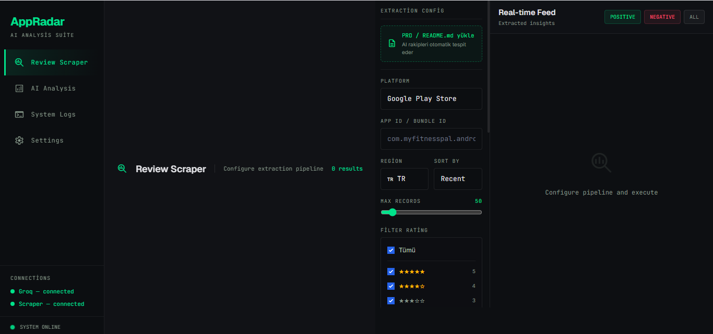
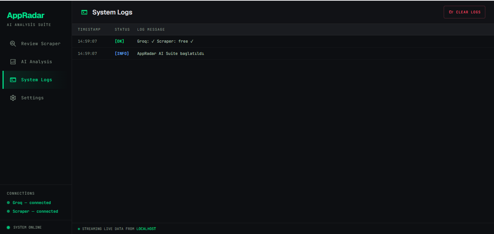

# AppRadar — Competitor Intelligence

## Görseller

| Ana Sayfa | AI Analysis | Logs |
|-----------|-------------|------|
|  |  |  |

## Kurulum (1 dakika)

### Windows
```
start.bat çift tıkla → tarayıcı otomatik açılır
```

### Mac / Linux
```bash
chmod +x start.sh
./start.sh
```

### Manuel
```bash
pip install flask requests
python app.py
# → http://localhost:5000
```

---

## API Keyler

**Settings** tab'ından gir, **Kaydet**'e bas.

| Servis | Nereden alınır |
|--------|---------------|
| Groq   | https://console.groq.com → API Keys |
| Apify  | https://console.apify.com → Settings → Integrations |

---

## Kullanım

1. `start.bat` (veya `start.sh`) çalıştır
2. Settings → API keylerini gir → Kaydet
3. Scraper → App ID gir (örn: `com.myfitnesspal.android`)
4. ▶ Start Scraping
5. AI Analysis → sol panelden analiz seç

---

## Deploy (Railway)

1. GitHub reposunu Railway'de "Deploy from GitHub repo" ile bağla.
2. **Variables**'a ekle:
   - `ADMIN_TOKEN` — rastgele güçlü bir gizli metin (örn. `openssl rand -hex 32`). Bu olmadan `/api/config` (yazma), `/api/groq` ve `/api/scrape` uçları kapalı kalır.
   - `GROQ_KEY`, `APIFY_KEY` — gerçek API key'lerin.
3. Deploy sonrası uygulamayı açıp **Settings → Admin Token** alanına 2. adımdaki `ADMIN_TOKEN` değerini gir ve Kaydet'e bas (tarayıcıda saklanır, isteklere otomatik eklenir).

## Apify Aktörleri

Varsayılan aktörler ücretsiz tier ile çalışır (~$5/ay kredi):
- Google Play: `compass/google-play-scraper`
- App Store: `nguyend59/app-store-reviews-scraper`

Alternatif aktörler Settings'ten değiştirilebilir.
